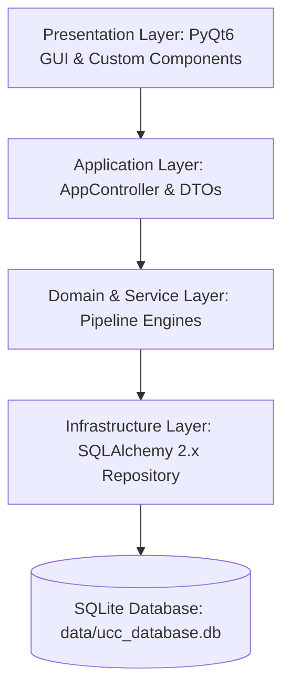
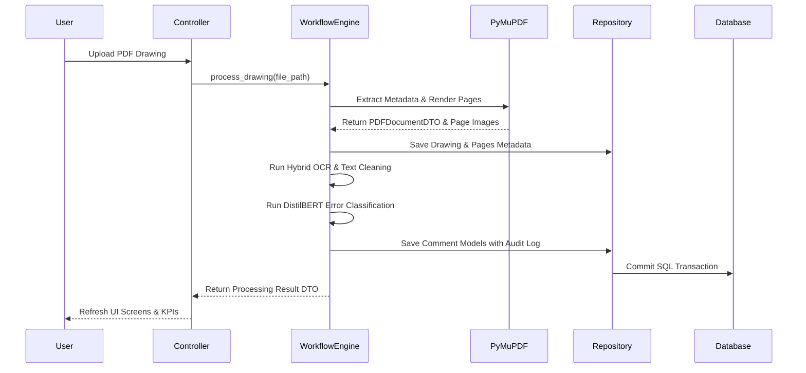

# Drawing Review Intelligence - System Architecture Overview

This document describes the architectural layout, data pipeline flow, database schema, and design patterns implemented in the Drawing Review Intelligence solution.

---

## 1. Architectural Layers

The application is structured into clean, decoupled architectural layers:

### Layer Responsibilities

1. **Presentation Layer (`app/`)**:
   - Built with PyQt6 using custom dark/light QSS theme system (`app/theme.py`).
   - Screens: Dashboard, Review, Analytics, Export, Upload, Comment Viewer.
   - Components: KPI Cards, PDF Toolbar, Search Bar, Comment Table, Filter Panel.

2. **Application Layer (`app/controllers/app_controller.py`)**:
   - Bridges UI signals with underlying domain services.
   - Converts domain objects into presentation DTOs.
   - Manages global state, active project context, and theme state.

3. **Service Layer (`src/services/`)**:
   - `WorkflowEngine`: Orchestrates PDF ingestion, OCR extraction, text cleaning, classification, and storage.
   - `VerificationService`: Handles human verification (Approve / Reject / Flag) and audit logging.
   - `AnalyticsService`: Generates live KPI stats, category distributions, and reviewer performance metrics.
   - `ExportService`: Produces formatted Excel, CSV, and JSON audit exports.
   - `TextCleaningService`: Engineering domain dictionary expansion, spell correction, and comment segmentation.

4. **Domain Layer (`src/core/domain/`)**:
   - `EngineeringTaxonomy`: 200+ ISO/ASME/IEEE engineering abbreviation dictionary, discipline catalog, and severity scoring.
   - `DrawingRuleEngine`: SLA resolution target calculation, drawing compliance scoring, and release readiness verification.

5. **Infrastructure & Storage Layer (`src/infrastructure/`)**:
   - `PyMuPDFAdapter`: PDF metadata extraction, page rendering, and text block extraction.
   - `DatabaseEngine` & Repositories (`CommentRepository`, `ProjectRepository`, `DrawingRepository`): SQLAlchemy 2.x ORM models and SQLite persistence.

---

## 2. Data Flow Pipeline

---

## 3. Database Entity-Relationship (ER) Schema

The database utilizes SQLite (`data/ucc_database.db`) managed via SQLAlchemy 2.x ORM models:

- **`projects`**: Top-level project container (id, name, status, progress, lead_engineer).
- **`drawings`**: Uploaded drawing metadata (id, project_id, file_name, file_hash, total_pages, drawing_number).
- **`pages`**: Individual pages within drawings (id, drawing_id, page_number, width, height).
- **`comments`**: Extracted review comments (id, page_id, raw_text, cleaned_text, bbox, status, category_id, priority_level).
- **`categories`**: Classification taxonomy categories (id, name, description, color_code).
- **`comment_audit_log`**: Version history and human verification trail (id, comment_id, action, reviewer_id, field_changed, timestamp).
- **`users`**: System reviewer accounts (id, username, display_name, email, role).
